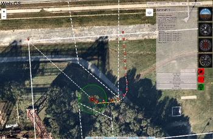
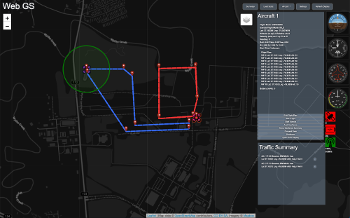
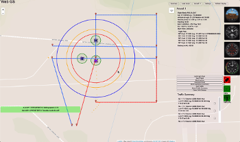

# WebGS

WebGS is a web-based ground control station that is compatible with [ICAROUS](https://github.com/nasa/icarous) (versions greater than 2.1.19) and capable of multi-aircraft simulations.

## Installation

Clone the repository.
Make sure you have installed node.js and [npm](https://www.npmjs.com/get-npm).
[Python3](https://www.python.org/downloads/) is also required.

The install script will download the required python and node packages, update the submodules to the latest versions, and build daa-displays.
Move into the webgs directory and run:

    ./install.sh

If updating WebGS and having trouble with submodules not loading. You may need to delete WebGS and start from scratch.

Webgs is setup by default to connect to Open Street Maps. Webgs is also configured to use mapbox for the background display. To get an authorization key go to <https://www.mapbox.com/> and create an account. After receiving an authorization token open `/webgs/MainJS/settings/MapSettings.js` in a text editor, and follow the instructions to update.

[DAA-Displays](https://github.com/nasa/daa-displays) is installed as a submodule in the applications folder `/DAA/daa-displays` by default. The installation script will build the daa-displays automatically. This behavior can be skipped by running `install.sh -D`. [DAA-Displays](https://github.com/nasa/daa-displays) can be launched from WebGS after connecting to an aircraft (no need to follow the instructions on <https://github.com/nasa/daa-displays>).

## Startup
By default WebGS uses https. This assumes the proper ssl certs have been generated and loaded into the `/certs` directory. Webgs can also be run in developer mode which uses http and does not require certs. Detailed instructions on creating self signed certificates are located in `/certs.README.md`.

To start Webgs:

    python3 start_webgs.py -HOST {name or localhost} -CERT {filename}.crt -KEY {filename}.key

Update `-HOST`, `-CERT` and `-KEY` as needed, `-CERT` and `-KEY` default to `localhost.crt` and `localhost.key` respectively, so they are not needed if that is the names you chose.

    python3 start_webgs.py -HOST {name or localhost}

Or, start with http:

    python3 start_webgs.py -DEV True

This script starts a local http server, starts the webgs socket server, and opens a web browser (chrome if it can be found otherwise the default browser) to `{hostname}:8082`.

There are potentially some compatibility issues with browsers other than Chrome and Firefox. These issues are mainly just styling. There may be some weird colors, or things may be slightly out of place.

### To connect to the server from another device (only if on the same local network)

If the web server and socket server are on another device on your local network. The server is not public facing, and will not be seen by anyone outside of the local network. Enter the ip address of the machine running the web server into the browser address bar in format `- {https or http}://<hostname>:8082`

### Connect WebGS over UDP

Assuming [ICAROUS](https://github.com/nasa/icarous) is configured properly, ensure you are on the same network as the device running [ICAROUS](https://github.com/nasa/icarous). Typically this will involve changing the IP address of your machine. Start the web server and the socket server. Ensure the Web page is connected to the socket server. In the settings panel, set:

    GCS Mode -> 'Connect to Hardware'
    Select Input Type -> IP
    IP Address -> {the same IP address ICAROUS is configured to output to}
    Component Id -> 5 (Default is 5. This is the standard ICAROUS Config. 0 will connect to Autopilot in most configurations.)

Ensure the Port and Baud Rate are correct. Press connect to aircraft.

### Connect WebGS via Serial USB Device

Assuming [ICAROUS](https://github.com/nasa/icarous) is configured properly, ensure you are on the same network as the device running [ICAROUS](https://github.com/nasa/icarous). Typically this will involve changing the IP address of your machine. Start the web server and the socket server. Ensure the Web page is connected to the socket server. In the settings panel, set:

    GCS Mode -> 'Connect to Hardware'
    Select Input Type -> USB
    IP Address -> {the same IP address ICAROUS is configured to output to}
    Component Id -> 5 (Default is 5. This is the standard ICAROUS Config. 0 will connect to Autopilot in most configurations.)

Ensure the Port and Baud Rate are correct. Press connect to aircraft.

### To run simulations

[ICAROUS](https://github.com/nasa/icarous) must be installed and properly built. On the settings page ensure

    GCS Mode is set to 'SITL'
    Path to ICAROUS is set correctly
    Path to Ardupilot is set correctly (if needed)
    SIM TYPE -> ArduCopter (Spelling and Capitalization Matter)

Then either right click on the map or click on the Aircraft button and select 'New Aircraft'. The parameters for [ICAROUS](https://github.com/nasa/icarous) in version 2 are auto loaded and they may need to be changed. This can be done once the aircraft is started.

### To view own-ship perspective flight instruments

After the aircraft has started, click Open DAA Display. This will open the display in a new tab. Currently this display only works on port 8082. If the server was launched on another port the map will not be displayed.

### Playback

Webgs uses the MAVProxy format for creating `.tlog` files for each flight. These files along with the Server logs, [ICAROUS](https://github.com/nasa/icarous) outputs, ardupilot outputs, and a text file containing all of the received mavlink messages are stored in the LogFiles directory. To playback a file, change the GCS Mode to Playback. Enter the file name in the text box. (It assumes files will be located in the LogFiles directory.) Click Start Playback. It may take a few seconds to load the file.

Note: I would not recommend fast forwarding at the beginning of the file. If you miss the flight plan messages, a flight plan will not show up on the map.

### Merging .tlog files for multi-aircraft playback

A Python3 script has been included for creating a `.mlog` file that webgs is capable of playing. It is located in webgs/utils/

    python3 mergeTlogs.py -h or --help for instructions on how to use it.

### Fly By File

Webgs is capable of flying scripted scenarios that are repeatable and adjustable. Functionality is still limited but it has been tested with four simulated aircraft flying simultaneously, each with multiple intruders and a geofence, repeated 50 times, adjusting parameters, flight plans, and intruders after 25 flights. Examples and instructions on building a script are located in `/webgs/Examples/TestScripts`.

## Current version

WebGS v1.0.8

## Notices

Copyright 2019 United States Government as represented by the Administrator of the National Aeronautics
and Space Administration. All Rights Reserved.

Disclaimers
No Warranty: THE SUBJECT SOFTWARE IS PROVIDED "AS IS" WITHOUT ANY WARRANTY OF ANY
KIND, EITHER EXPRESSED, IMPLIED, OR STATUTORY, INCLUDING, BUT NOT LIMITED TO, ANY
WARRANTY THAT THE SUBJECT SOFTWARE WILL CONFORM TO SPECIFICATIONS, ANY IMPLIED
WARRANTIES OF MERCHANTABILITY, FITNESS FOR A PARTICULAR PURPOSE, OR FREEDOM FROM
INFRINGEMENT, ANY WARRANTY THAT THE SUBJECT SOFTWARE WILL BE ERROR FREE, OR ANY
WARRANTY THAT DOCUMENTATION, IF PROVIDED, WILL CONFORM TO THE SUBJECT SOFTWARE.
THIS AGREEMENT DOES NOT, IN ANY MANNER, CONSTITUTE AN ENDORSEMENT BY GOVERNMENT
AGENCY OR ANY PRIOR RECIPIENT OF ANY RESULTS, RESULTING DESIGNS, HARDWARE,
SOFTWARE PRODUCTS OR ANY OTHER APPLICATIONS RESULTING FROM USE OF THE SUBJECT
SOFTWARE.  FURTHER, GOVERNMENT AGENCY DISCLAIMS ALL WARRANTIES AND LIABILITIES
REGARDING THIRD-PARTY SOFTWARE, IF PRESENT IN THE ORIGINAL SOFTWARE, AND
DISTRIBUTES IT "AS IS."

Waiver and Indemnity:
RECIPIENT AGREES TO WAIVE ANY AND ALL CLAIMS AGAINST THE UNITED
STATES GOVERNMENT, ITS CONTRACTORS AND SUBCONTRACTORS, AS WELL AS ANY PRIOR
RECIPIENT.  IF RECIPIENT'S USE OF THE SUBJECT SOFTWARE RESULTS IN ANY LIABILITIES,
DEMANDS, DAMAGES, EXPENSES OR LOSSES ARISING FROM SUCH USE, INCLUDING ANY
DAMAGES FROM PRODUCTS BASED ON, OR RESULTING FROM, RECIPIENT'S USE OF THE SUBJECT
SOFTWARE, RECIPIENT SHALL INDEMNIFY AND HOLD HARMLESS THE UNITED STATES
GOVERNMENT, ITS CONTRACTORS AND SUBCONTRACTORS, AS WELL AS ANY PRIOR RECIPIENT,
TO THE EXTENT PERMITTED BY LAW.  RECIPIENT'S SOLE REMEDY FOR ANY SUCH MATTER SHALL
BE THE IMMEDIATE, UNILATERAL TERMINATION OF THIS AGREEMENT.

### Contact

Andrew Peters andrew.peters@nianet.org  
Cesar Munoz cesar.a.munoz@nasa.gov
